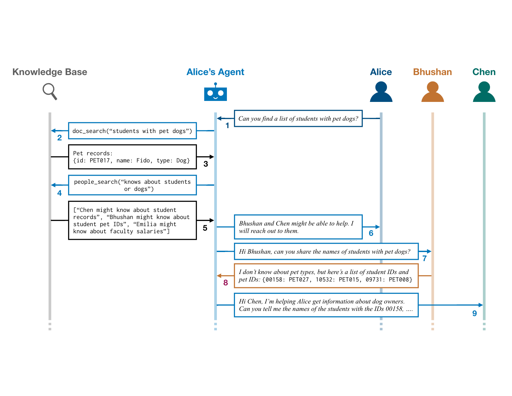

# Experiment Scripts



## Create configurations
`python workspace/peoplejoin-qa/create_peoplejoinqa_configs.py --split test`


## Experiment

## Sanity Check with HITL
- Start backend:
`make backend AGENT_CONF=workspace/peoplejoin-qa/experiments/agent_configs/agentconf_allergy_1_gpt4o.json`
    - This will start the backend, and load an initial agent based on the provided config
    - The exact agent config file used here doesn't matter, as the experiment script will trigger reloading the agent with correct config

- Open a new terminal window and run the following experiment: 
`python src/experimentation/experiment_with_hitl_or_simulation.py workspace/sample_run/sample_spider_exp_config.json workspace/sample_run/saved_output`
    - backend reloads the agent with the correct configuration
    - `workspace/sample_run/saved_output` is the save location directory


## Running experiment

### Pick experiment

- A. gpt-4o; without cot; gpt-4 sim-user
  - `WORKSPACE_DIR='workspace/peoplejoin-qa/experiments/gpt4o'`

- B. A without CoT
  - `WORKSPACE_DIR='workspace/peoplejoin-qa/experiments/gpt4o_nocot'`

- C. gpt4turbo backend instead of gpt-4o
  - `WORKSPACE_DIR='workspace/peoplejoin-qa/experiments/gpt4turbo'`

- D. C without CoT
  - `WORKSPACE_DIR='workspace/peoplejoin-qa/experiments/gpt4turbo_nocot'`

- E. phi-3-medium backend instead of gpt-4o
  - `WORKSPACE_DIR='workspace/peoplejoin-qa/experiments/phi3medium'`

- F. E without CoT
  - `WORKSPACE_DIR='workspace/peoplejoin-qa/experiments/phi3medium_nocot'`  


MessageAllOnce and MessageNone baselines
- G. `WORKSPACE_DIR='workspace/peoplejoin-qa/experiments/gpt4turbo_messageall'`

- H. `WORKSPACE_DIR='workspace/peoplejoin-qa/experiments/gpt4turbo_messagenone'`
  - Set `IS_MESSAGE_NONE_MODE = True` in `src/async_collab/orchestrator/orchestrators/event_reactive/reactive_promptbuilder.py` for this experiment (and remember to set it back to False after this experiment)


### Setup folders
```
# Remove previous saved outputs
/bin/rm -rf "$WORKSPACE_DIR/saved_outputs/*"

# Create directory for saved outputs
mkdir "$WORKSPACE_DIR"/saved_outputs/

# Create directory for logs
mkdir "$WORKSPACE_DIR"/logs
```

### Run experiment

```
# Run all the experiments one by one
for i in {0..499}
do
    echo "======================================================================>>>>>>>>>>>>>>>>>>>>"
    exp_config_path="$WORKSPACE_DIR""/exp_configs_test/experiment_$i.json"
    echo $exp_config_path
    python src/experimentation/experiment_with_hitl_or_simulation.py $exp_config_path "$WORKSPACE_DIR"/saved_outputs/ > "$WORKSPACE_DIR"/logs/experiment_"$i".log
    mv logs/simulated_user.log "$WORKSPACE_DIR"/logs/experiment_"$i"_simulated_user.log
done
```


### Metrics:

Compute metrics:

```
echo $WORKSPACE_DIR
python src/experimentation/run_evals.py --saved_outputs_folder "$WORKSPACE_DIR"/saved_outputs/ --metrics_file "$WORKSPACE_DIR"/metrics.json --metric_names task_efficiency reference_overlap_using_llm people_contacted --cache_file_name "$WORKSPACE_DIR"/llm_eval_cache.txt
mv logs/eval.log  "$WORKSPACE_DIR"/logs/eval.full.log
```

Final metrics can be found at `"$WORKSPACE_DIR"/metrics.json`


### HITL mode
If wanting to run with a HITL setup, then proceed as follows:
- Start backend if not already running
  - `make backend AGENT_CONF=workspace/peoplejoin-qa/experiments/agent_configs/agentconf_allergy_1_gpt4o.json`
- Open a new terminal window and run the following experiment: 
`python src/experimentation/experiment_with_hitl_or_simulation.py workspace/sample_run/sample_spider_hitl_exp_config.json workspace/sample_run/saved_output`
    - backend reloads the agent with the correct configuration
    - `workspace/sample_run/saved_output` is the save location directory


